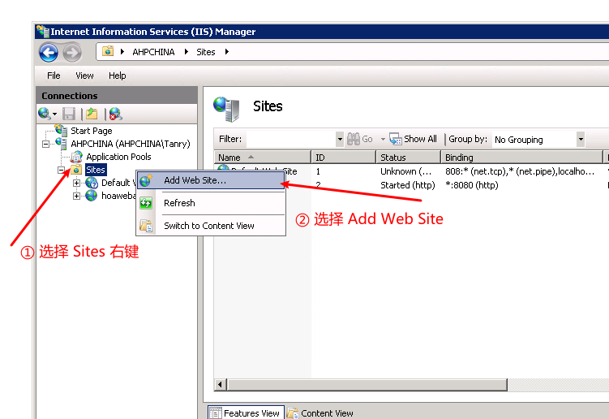
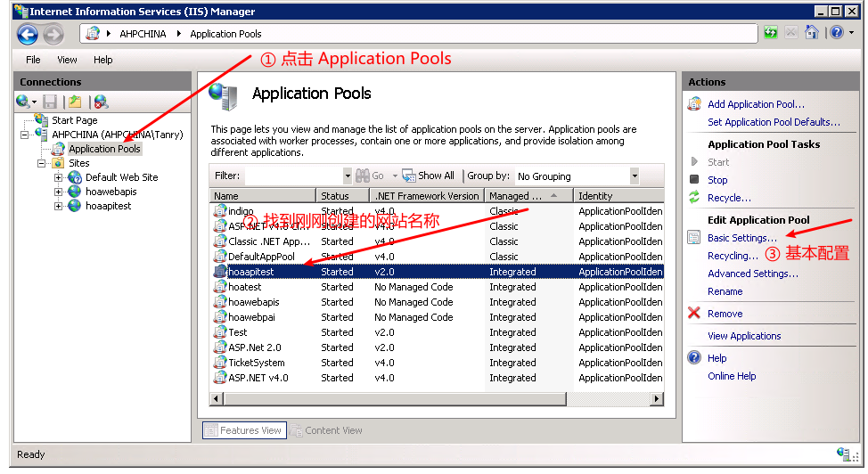
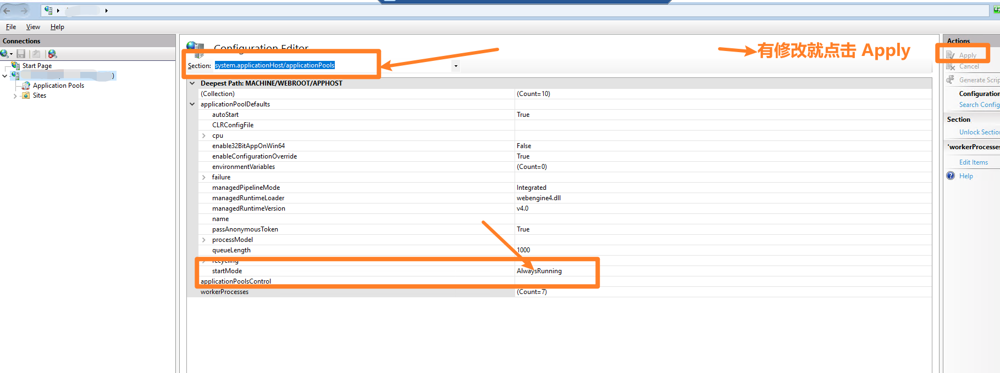
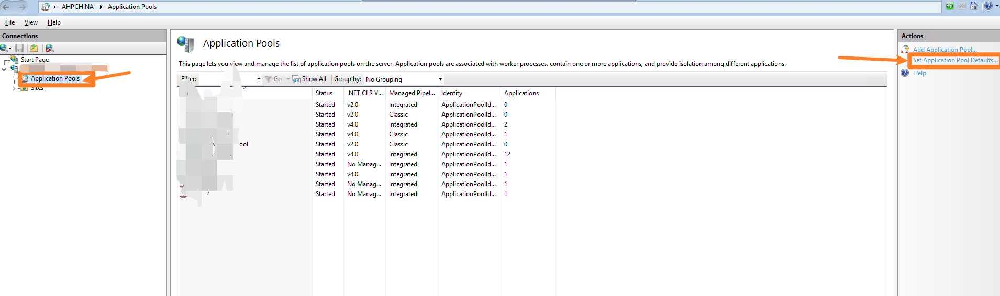

# 在 IIS 部署

## 开启CGI和ISAPI扩展
- MVCXE提供了Webborker.ISAP服务程序，要加载该程序需要开启IIS的CGI和ISAPI扩展

否则你需要在控制面板->启动或关闭Windows功能，安装CGI和ISAPI扩展

- 打开ISAPI限制

## 开启URL Rewrite模块

否则你需要到iis.net网站[下载URL Rewrite Module 2.1](http://www.iis.net/downloads/microsoft/url-rewrite)

也可以[安装Application Request Routing（如果要实现站外重写需要安装这个模块）](http://www.iis.net/downloads/microsoft/application-request-routing)

## 添加新网站

- 配置网站信息

- 配置应用程序池

- 设置为 非托管

- 配置应用高级选项

- 32位MVCXE应用程序池要启用32位应用程序

## 设置文件系统权限
- wwwroot目录需要设置用户IUSR/IIS_IUSRS读取权限
- wwwroot\App_Data\Log和wwwroot\App_Data目录需要设置用户IUSR/IIS_IUSRS读取执行权限
- 你的程序需要上传文件的目录（如wwwroot\uploads）需要设置用户IUSR/IIS_IUSRS读写（不能执行）权限

## 设置MVCXE程序目录结构
正常情况下MVCXE的网站目录如下：

    ├── output
    │   ├── bds bpl files
    │   ├── mvcxe bpl files
    │   ├── mvcxe server exe/dll files
    │   ├── other dll files
    │   ├── areas
    │   │   ├── area1
    │   │   ├── area2
    │   │   └── area3
    │   ├── views
    │   │   ├── view1
    │   │   ├── view1
    │   │   └── Shared
    │   ├── wwwroot
    │   │   ├── App_data
    │   │   ├── files
    │   │   ├── folders
    │   │   ├── isapi_webborker.dll
    │   │   └── web.config
    │   ├── appsettings.json
    │   ├── launchSettings.json
    │   ├── sqlMap.xml

但因为IIS特性，我们需要设置wwwwroot目录为网站根目，iis是不允许执行根目录外的程序，所以需要将mvcxe程序放于较安全的App_data目录中，你需要将output目录下除了wwwroot外的所以文件/目录拷贝到wwwroot\App_data下，如下：

    ├── wwwroot
    │   ├── html files
    │   ├── folders
    │   ├── isapi_webborker.dll
    │   ├── App_data
    │   │   ├── areas
    │   │   │   ├── area1
    │   │   │   ├── area2
    │   │   │   └── area3
    │   │   ├── views
    │   │   │   ├── view1
    │   │   │   ├── view1
    │   │   │   └── Shared
    │   │   ├── bds bpl files
    │   │   ├── mvcxe bpl files
    │   │   ├── other dll files
    │   │   ├── appsettings.json
    │   │   ├── launchSettings.json
    │   │   └── sqlMap.xml
    │   ├── web.config

## 一些额外需要注意的地方
- 因为安全特性，launchSettings.json中`EnabledPackageScan`需要设置为`false`,同时你要加载的bpl都需要写在`ExternalPackages`中

        {
        "packages": {
            "EnabledPackageScan": false,
            "IgnorePackageFiles": ["MVCXE.Core","inet","rtl","vcl","xmlrtl","IndyCore","IndyProtocols","IndySystem","CustomIPTransport","IndyIPCommon","IndyIPServer","dbrtl"],
            "ExternalPackages": [{
                "Name": "FireDACCommon"
                },{
                "Name": "FireDACCommonDriver"
                },{
                "Name": "FireDAC"
                },{
                "Name": "FireDACSqliteDriver"
                },{
                "Name": "FireDACCommonOdbc"
                },{
                "Name": "FireDACMSSQLDriver"
                },{
                "Name": "FireDACMySQLDriver"
                },{
                "Name": "FireDACOracleDriver"
                },{
                "Name": "FireDACPgDriver"
                },{
                "Name": "MVCXE.Core"
                },{
                "Name": "MVCXE.Web"
                },{
                "Name": "MVCXE.LoggerPro"
                },{
                "Name": "MVCXE.Cache"
                },{
                "Name": "MVCXE.ORM"
                },{
                "Name": "MVCXE.TPL"
                },{
                "Name": "MVCXE.Quartz"
                },{
                "Name": "MVCXE.Captcha"
                },{
                "Name": "MVCXE.Swagger"
                },{
                "Name": "_NameSpace_BLL"
                },{
                "Name": "_NameSpace_Web",
                "Area": "",
                "RoutePrefix": "",
                "IOC": [
                    {
                        "interface": "IPostService",
                        "implement": "_NameSpace_Service.Post.TPostService"
                    },
                    {
                        "interface": "ICategorieService",
                        "implement": "_NameSpace_Service.Categorie.TCategorieService"
                    }
                ]
                }]
            }
        }

- 需要在IIS部署运行的程序，代码里向控制台写Debug信息的代码Write/WriteLn会出错，需要你用try/catch处理

## IIS常见问题
### 状态码，不支持 PUT，DELETE 请求

默认情况下，IIS拒绝 PUT和 DELETE 请求，原因为 IIS 默认注册了一个名为 WebDAVModule 的自定义 HttpModule 导致的。

解决该问题，只需要在 web.config 移除即可：

        <configuration>
        <system.webServer>
        <modules runAllManagedModulesForAllRequests="true">
            <remove name="webDAVModule"/>
        </modules>
        </system.webServer>
        </configuration>

微软官方文档：[https://docs.microsoft.com/zh-cn/troubleshoot/developer/webapps/iis/health-diagnostic-performance/http-error-405-website](https://docs.microsoft.com/zh-cn/troubleshoot/developer/webapps/iis/health-diagnostic-performance/http-error-405-website)

### IIS 回收问题和配置

通过 IIS 部署`MVCXE`应用程序，如果启动了系统日志，就会发现经常出现`Application is shutting down...`的日志，代表 IIS 回收了应用程序池。

对于一个长期在线的网站来说，这是非常不合理的，所以我们可以通过以下配置让 IIS 进行长时间不访问便回收的机制。

配置步骤如下：

- 打开 IIS 并点击左侧树根节点（计算机名称）并点击右侧的 Configuration Editor（配置编辑器）

- 在 Section（节）选择 system.applicationHost/applicationPools 并设置 startMode 为 AlwaysRunning，之后点击 Apply 保存。

- 点击左侧树根节点（计算机名称）下的 Application Pools 并点击最右侧的 Set Appliation Pool Defaults...（设置应用程序池默认配置...）

- 设置 Idle Time-out (minutes)（闲置超时（分钟）为 0

