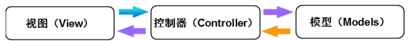

# 动态 WebAPI

## 什么是控制器
简单来说，控制器是一个承上启下的作用，根据用户输入，执行响应行为（动作方法），同时在行为中调用模型的业务逻辑，返回给用户结果（视图）。

## 控制器的表现形式
在 `MVCXE` 中，控制器有两种表现形式：
> 引入MVCXE单元

	uses MVCXE;

> Mvc（带视图）

	type
	  TMvcController = class(TController)
	  public
		function Index: string;
	  end;
	implementation
	function TMvcController.Index: string;
	begin
	  Result := View;
	end;

> WebAPI（RESTful API）

	type
	  TSysUserResult = record
		code: Integer;
		data: TSysUserData;
		msg: string;
	  end;
	  [Route('user/profile')]
	  TMyWebApi = class(TWebApi)
	  public
		function GET: TSysUserResult;
	  end;
	implementation
	function TMyWebApi.GET: TSysUserResult;
	begin
	  Result.code := 0;
	  Result.msg := '';
	end;

Mvc 控制器和 WebAPI 控制器最大的区别是 `WebAPI` 控制器不带 **视图** 和通过 **请求谓词和路由地址响应行为**。

## 控制器的约定
在 `MVCXE` 中，MVC与WebAPI都需要遵循一些约定

>MVC 约定

- 控制器类必须继承 TController 或间接继承
- 动作方法不区分HttpVerb，如果要区分必须贴有 [HttpMethod] 特性，如：[HttpGet]
- 无需手动配置 [Route] 特性，支持更加灵活的配置及自动路由生成
- 生成路由地址时会自动截取控制器名称 T和Controller 之间的内容，同时也会去掉动作方法匹配的 HttpVerb 谓词，如 GET，POST，DELETE，PUT 等
- 支持返回字符串或流对象，如果返回类，会序列化成json或xml
- 支持 GET、HEAD 请求自动转换 类类型参数

> WebAPI 约定

- 控制器类必须继承 TWebApi 或间接继承, 具备原有的 TController 所有功能
- 无需手动配置 [HttpMethod] 特性，同时支持一个动作方法多个 HttpVerb
- 无需手动配置 [Route] 特性，支持更加灵活的配置及自动路由生成
- 支持返回泛型接口，泛型类
- 和 Swagger 深度结合，提供极其方便的创建 Swagger 分组配置
- 支持 Basic Auth，Jwt，ApiKey 等多种权限灵活配置
- 支持 GET、HEAD 请求自动转换 类类型参数

## 注册动态 MVC/WebAPI 服务
`MVCXE`应用构建时，我们可将应用代码写在不同的Project,他们生成bpl放于Web应用的根目录中，`MVCXE`会自动发现bpl中的控制器，无需手动注册。

可在`launchSettings.json`中进行相关设置

	{
	  "packages": {
		"EnabledPackageScan": false,
		"IgnorePackageFiles": ["MVCXE.Core.bpl","inet280.bpl","rtl280.bpl","vcl280.bpl","xmlrtl280.bpl","IndyCore280.bpl","IndyProtocols280.bpl","IndySystem280.bpl","dbrtl280.bpl"],
		"ExternalPackages": [{
		  "Name": "Test1",
		  "Area": "test",
		  "RoutePrefix": "test"
		}]
	  }
	}

> EnabledPackageScan=true

`MVCXE`会自动扫描加载除`IgnorePackageFiles`外的所有bpl文件

> EnabledPackageScan=false

`MVCXE`会加载`ExternalPackages`所设定的bpl列表，`Name`为bpl文件名(不带扩展名.bpl)，`Area`是控制器配置文件及视图所在目录如果为空使用根目录，`RoutePrefix`是路由生成的前缀目录

## 第一个例子
创建一个 TMyWebApi 类继承 TWebApi，并在这个类中编写一个 Get 方法。

	type
	  TMyWebApi = class(TWebApi)
	  public
		function GET: string;
	  end;
	implementation
	function TMyWebApi.GET: string;
	begin
	  'Hello '+Self.ToString;
	end;

如下图所示，一个 WebAPI 接口就这么生成了。

## 动态 WebAPI 原理解析
`MVCXE` 框架会在应用启动时注册 `类名为T{?}Controller或T{?}WebApi`控制器特性提供器，该提供器继承自`TController或TWebApi`类。

### 请求谓词默认约定
> 动作方法名
> - 以 Post/Add/Create/Insert/Submit/Change 开头，则添加 `[HttpPost]` 特性。
> - 以 GetAll/GetList/Get/Find/Fetch/Query 开头，则添加 `[HttpGet]` 特性。
> - 以 Put/Update 开头，则添加 `[HttpPut]` 特性。
> - 以 Delete/Remove/Clear 开头，则添加 `[HttpDelete]` 特性。
> - 以 Patch 开头，则添加 `[HttpPatch]` 特性

> 如果不在上面约定中，`MVC`忽略，`WebAPI`则默认添加 `[HttpPost]` 特性。

### 路由地址默认约定
`MVCXE` 框架的路由格式(默认转换为小写路由地址)是：**前缀/模块名/动作方法名/参数**

> 前缀

如果在`launchSettings.json`设置了该动态WebAPI所在bpl的`RoutePrefix`，**以该设定为前缀** 
否则**没有前缀**

> 模块名

模块名取值是控制器类名类名为T{?}Controller或T{?}WebApi的{?}部分，如果设置了控制类的属性`[Route('{自定义模块名}')]`则**用自定义模块名**

> 动作方法名

动作方法名取值控制器类public的函数或方法名，默认去除以 `Post/Add/Create/Insert/Submit`，`GetAll/GetList/Get/Find/Fetch/Query/Search`，`Put/Update`，`Delete/Remove/Clear`，`Patch` 开头的字符串。 
如果设置了函数或方法的属性`[Route('{自定义动作方法名}')]`则**用自定义动作方法名**

> 参数

如果有参数这部份，以`/`分割为多个参数，按顺序传入动作方法对应的函数参数中