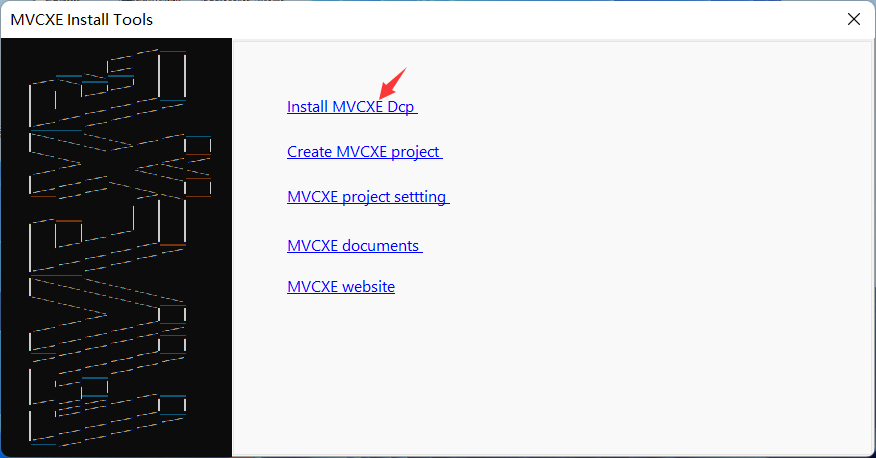
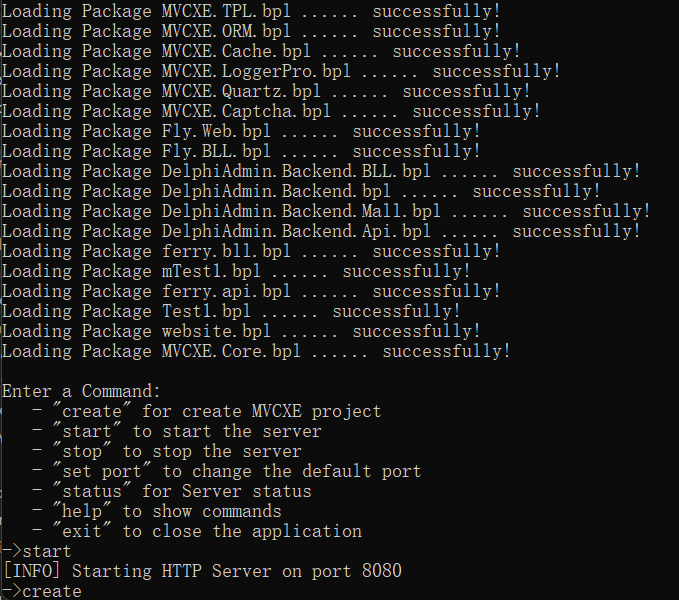
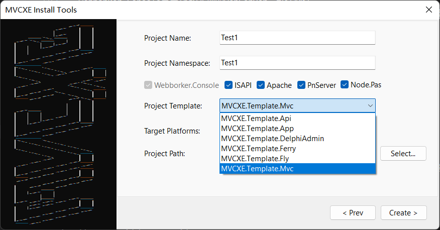
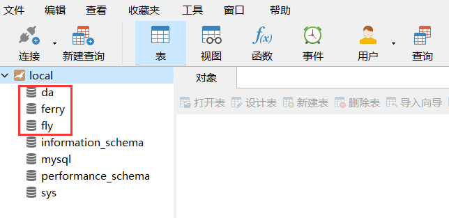
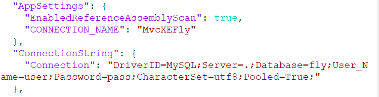
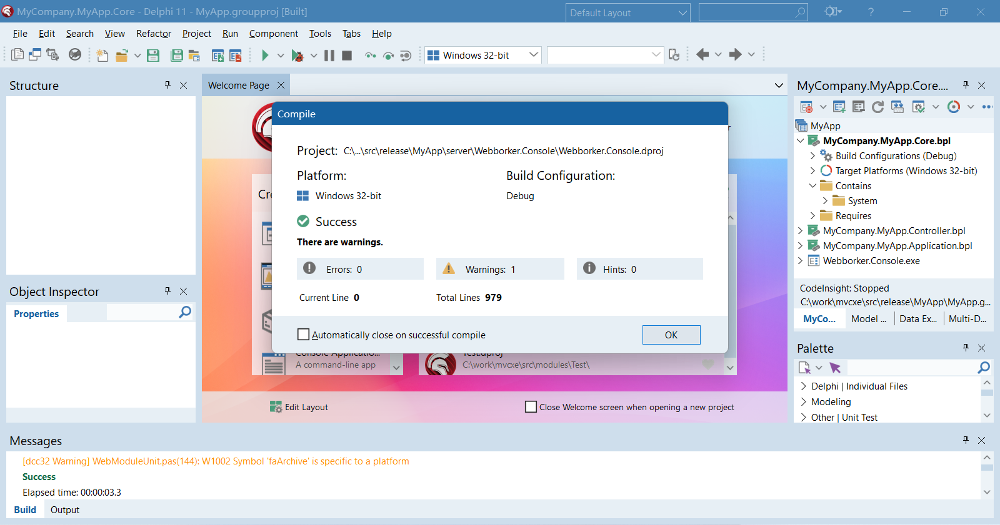
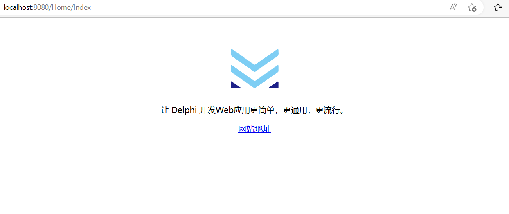
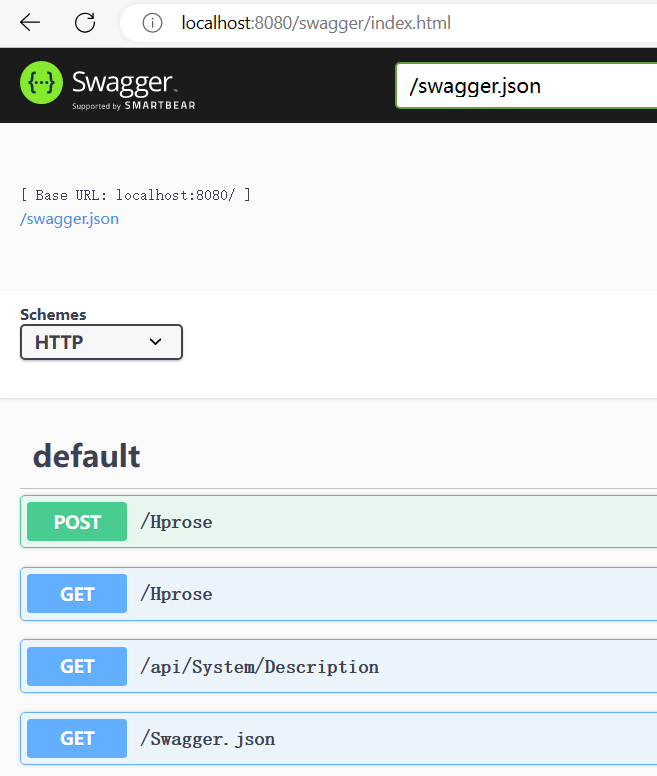

# 一分钟上手

## 先欣赏两段常见代码
> MVC

	type
	  THomeController = class(TController)
	  private
	    [IOC]
	    PostService: IPostService;
	  public
	    function Index: string;
	  end;
	implementation
	function THomeController.Index: string;
	begin
	  ViewBag.Add('TopPosts', PostService.GetTopPosts(5));
	  Result := View;
	end;

> Webapi

	type
	  [Route('user/profile')]
	  TUserWebApi = class(TWebApi)
	  private
	    [IOC('Your.Service.UserService')]
	    UserService: IUserService;
	  public
	    [Authorize('Your.Authorization.YourAuthorization', 'your_role_str')]
	    function GET: TUser;
	  end;
	implementation
	function TUserProfileWebApi.GET: TUser;
	begin
	  Result.code := 200;
	  Result.data := current_user;
	  Result.dept := SysService.DeptById(current_user.dept_id);
	  SetLength(Result.postIds, 1);
	  Result.postIds[0] := current_user.post_id;
	  Result.posts := SysService.Posts;
	  SetLength(Result.roleIds, 1);
	  Result.roleIds[0] := current_user.role_id;
	  Result.roles := SysService.Roles;
	  Result.msg := '';
	end;
	
## 创建工程
> 在Delphi IDE中打开工程组mvcxe3_install.groupproj，并编译运行InstallTools

### 点击"Install MVCXE Dcp"安装MVCXE所需要的编译单元文件

### 点击"Create MVCXE Project"
> 按你的需求填好：工程名，命名空间等信息，然后点“Create”创建一个MVCXE工程。

> Web服务器选项

- Webborker.Console是用Indy实现的WebServer，默认必选。
- ISAPI是ISAPI模块(Apache安装方法参考源码里的注释,IIS安装方法参考网上教程，另需要将output目录下非wwwroot目录的文件剪贴到wwwroot里的App_Data目录内)
- Apache是Apache DSO模块(安装方法参考源码里的注释)
- PnServer是用Http.Sys实现的WebServer（有些系统需要管理员权限运行）
- Node.Pas是用LibUV实现的WebServer

> 工程模板选项

- MVCXE.Template.Api创建的是WebApi工程,只输出Api,不输出网页内容,自带Swagger。
- MVCXE.Template.Mvc创建的是Mvc工程，可以使用模板生成网页内容。
- MVCXE.Template.App创建的是WebApi/Mvc混合工程，包括Api也有网页内容。
- MVCXE.Template.Fly创建的是范例：Fly社区。
- MVCXE.Template.DelphiAdmin创建的是范例：后台管理脚手架。
- MVCXE.Template.Ferry创建的是范例：开源项目Ferry的后端Delphi实现。

### 打开创建好的工程

> 目录结构
- output是编译输出目录，也就是Web站点最终发布目录
- server是Web服务器程序源码目录
- ProjectName(Test1)是MVCXE程序目录
- ProjectName\Controller存放MVC的控制器工程
- ProjectName\Webapi存放存WebApi工程
- ProjectName\BLL存放数据逻辑层的工程
- output\views存放模板文件

> Fly/DelphiAdmin/Ferry需要数据库配合才能跑起来

- 在mysql中新建立三个数据库(字符集用utf8),使用db目录下的fly_mysql.sql还原数据库fly,da_mysql.sql还原数据库da，ferry_mysql.sql还原数据库ferry

- 并修改output\appsettion.json中ConnectionString内的数据库连接信息。

> 用模板创建的工程，默认使用8080端口，可launchSettings.json里修改。

- Fly社区：http://localhost:8080/，管理员帐号admin，密码123456
- DelphiAdmin后台管理脚手架：http://localhost:8080/backend/，管理员帐号admin，密码123456
- Ferry后台Api：http://localhost:8080/swagger/index.html
- Ferry前端安装可参考：https://www.fdevops.com/docs/ferry-tutorial-document/install

### 编译并运行Webborker.Console.exe

- 程序会自动打开浏览器，并访问默认的地址

- 访问Swagger查看现有的WebApi

http://localhost:8080/swagger/index.html

## 现在你可以进行Delphi Web开发的神奇之旅了