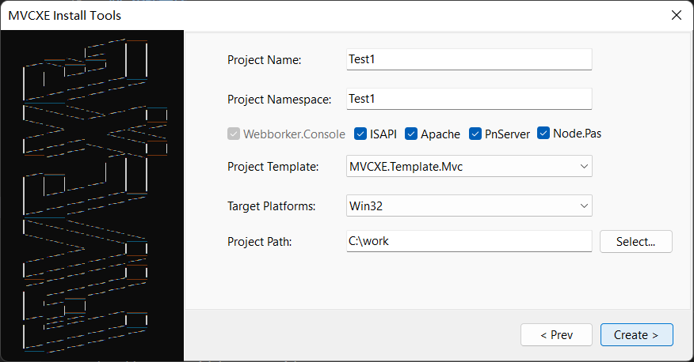
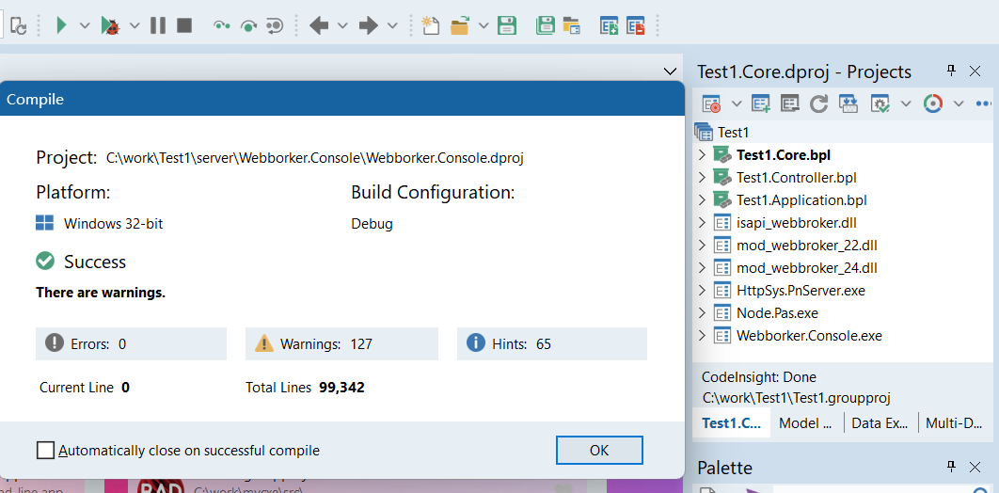

# 一分钟上手

## 先欣赏两段常见代码
> MVC

	type
	  THomeController = class(TController)
	  private
		[IOC]
		PostService: IPostService;
	  public
		function Index: string;
	  end;
	implementation
	function THomeController.Index: string;
	begin
	  ViewBag.Add('TopPosts', PostService.GetTopPosts(5));
	  Result := View;
	end;

> Webapi

	type
	  [Route('user/profile')]
	  TUserWebApi = class(TWebApi)
	  private
		[IOC('Your.Service.UserService')]
		UserService: IUserService;
	  public
		[Authorize('Your.Authorization.YourAuthorization', 'your_role_str')]
		function GET: TUser;
	  end;
	implementation
	function TUserProfileWebApi.GET: TUser;
	begin
	  Result.code := 200;
	  Result.data := current_user;
	  Result.dept := SysService.DeptById(current_user.dept_id);
	  SetLength(Result.postIds, 1);
	  Result.postIds[0] := current_user.post_id;
	  Result.posts := SysService.Posts;
	  SetLength(Result.roleIds, 1);
	  Result.roleIds[0] := current_user.role_id;
	  Result.roles := SysService.Roles;
	  Result.msg := '';
	end;
	
## 创建工程
先将Dcp目录的文件Copy到Delphi 11的Dcp公共目录，如：C:\Users\Public\Documents\Embarcadero\Studio\22.0\Dcp 
在Delphi IDE中打开mvcxe.groupproj，运行Project:Webborker.Console 

- 在控制台窗口中输入create回车，创建工程

- 输入工程名，例MyApp

- 选择工程模板，选1是只有WebApi，选3是只有Mvc，选2是混合
- 输入空间名，例MyCompany，可以为空

- 最后用Delphi IDE打开工程MyApp.groupproj并编译

- 运行Webborker.Console,自动打开浏览器，并访问默认的地址

- 切换地址/swagger/index.html访问Swagger查看现有的WebApi

## 将创建好的工程移到你常用的目录，添加到源码管理器git或svn，就可以进行Delphi Web开发的神奇之旅。